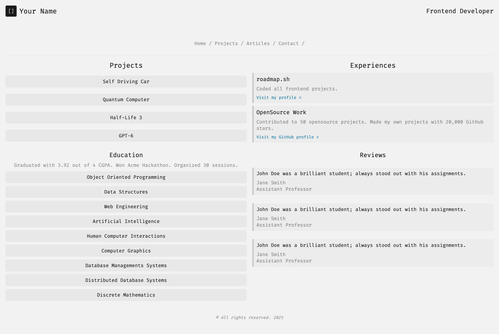

# Personal Portfolio
This project is built as part of my web development practice, following the practices from [roadmap.sh](https://www.roadmap.sh).

## The Project
[Personal Portfolio](https://roadmap.sh/projects/portfolio-website).

### Tech Stack
- Frontend: HTML, CSS
- Version Control: Git, Github
- Hosting: GitHub Pages

### Features
- Responsive Design
- Dark & Light Theme
- About, Project Showcase, Contact sections.

### Learning Goals
- Improve my understanding of responsive web design and UI/UX principles.
- Enhance my frontend skills.
- Gain experience with version control (Git), hosting, and deploying a website.

### Screenshot
